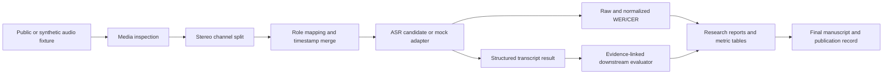

# Kanonik Public Sistem Mimarisi

Bu belge, ayrı public depolardaki anlamlı parçaların tek bir araştırma ve çalışma akışında nasıl birleştiğini açıklar. Kodlar geçmişlerini korumak için ayrı repolarda kalır; bu depo commit-kilitli kanonik giriş noktasıdır.

## 1. Katmanlar



## 2. Repo sorumlulukları

### 2.1. Kanonik araştırma merkezi

`whisper-turkish-domain-adaptation`

Sorumluluk:

- deney tasarımı,
- Legacy ve A0–A7 arşivi,
- raw/normalized WER/CER referans kodu,
- negatif sonuçlar,
- public metric tabloları,
- final makale,
- component lock ve bootstrap.

Public default sentetik fixture’dır. Tarihsel A0–A7 metriklerini yeniden üretmek için özel checkpoint/audio içermez.

### 2.2. Media ve kanal işleme

`turkish-speech-processing-platform`

Sorumluluk:

- WAV container inceleme,
- mono/stereo doğrulama,
- gerçek byte-level stereo split,
- rol eşleme,
- timestamp normalize/merge,
- duplicate suppression,
- JSON/text/SRT render,
- fixture WER/CER ve API.

Public varsayılan ASR mock’tur. Gerçek Whisper veya VAD entegrasyonu adapter sınırında yapılır.

### 2.3. Downstream transcript değerlendirmesi

`contact-center-ai-evaluation-suite`

Sorumluluk:

- typed Pydantic schema,
- evidence excerpt,
- explicit `insufficient_evidence`,
- sentetik çağrı görev paketleri,
- CLI/API ve testler.

Bu katman ASR doğruluğunu ölçmez. ASR transcriptinin downstream yapılandırılmış değerlendirme sözleşmesine girişini gösterir.

### 2.4. Yayın ve portföy

- `research-publications`: authoritative publication metadata.
- `applied-ai-engineering-portfolio`: proje kanıt seviyesi ve public vaka dizini.
- `Darkem0` profil deposu: keşif ve yönlendirme.

## 3. Gerçek model entegrasyon sınırı

Public demo güvenli ve sentetik kalır. Gerçek model kullanmak isteyen kişi kendi lisanslı verisi ve model erişimiyle şu adapterı eklemelidir:

```text
Media fixture or licensed audio
→ channel-aware preprocessor
→ local Whisper/Transformers adapter
→ candidate transcript JSON
→ evaluation normalizer and WER/CER
→ optional downstream evaluator
```

Zorunlu kontroller:

- model ve processor revision,
- sample rate ve channel layout,
- language/task promptu,
- decode config,
- timestamp mode,
- prediction hash,
- reference provenance,
- data license ve privacy.

## 4. Telefon ve genel Türkçe paneli

Tek bir birleşik skor kullanılmaz.

### Telefon paneli

- MediaSpeech Phone,
- G.711,
- robustness proxy,
- CV Spontaneous report-only,
- kısa utterance/deletion,
- tekrar ve hallucination.

### Genel Türkçe paneli

- MediaSpeech Clean,
- CV Scripted,
- FLEURS,
- TSC.

Model seçimi hedef kullanıma göre yapılır. Genel-domain regresyonu saklanmaz; telefon kazancını da otomatik olarak geçersiz kılmaz.

## 5. Yeniden üretilebilir workspace

`ecosystem/components.lock.json` her companion repo için commit SHA sabitler.

```bash
python scripts/bootstrap_public_ecosystem.py --destination components
```

Script:

- public repoları klonlar,
- locked commit’i detached HEAD olarak checkout eder,
- HEAD eşitliğini doğrular,
- private veri veya model indirmez.

## 6. Neden tek Python paketi değil?

Tek monolitik package şu riskleri yaratır:

- araştırma ve ürün demo dependency’lerinin karışması,
- sentetik ve gerçek iddiaların bulanıklaşması,
- bağımsız testlerin kaybı,
- aynı kodun farklı amaçlarla fork edilmesi,
- companion repo geçmişinin silinmesi.

Kanonik hub + pinned components yaklaşımı, tek giriş noktası ile bağımsız bakım arasında denge sağlar.

## 7. Public güvenlik sınırı

Aşağıdakiler bu mimarinin public kısmına dahil değildir:

- ham özel çağrı sesi,
- müşteri/çalışan transkripti,
- private model checkpointi,
- internal API veya database topolojisi,
- kişisel veri,
- lisansı belirsiz veri kopyası.

Gerçek veri ile çalışma, ayrı ve kullanıcı tarafından yönetilen local adapter/config katmanında kalmalıdır.
